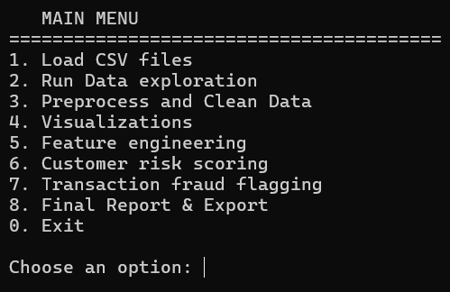
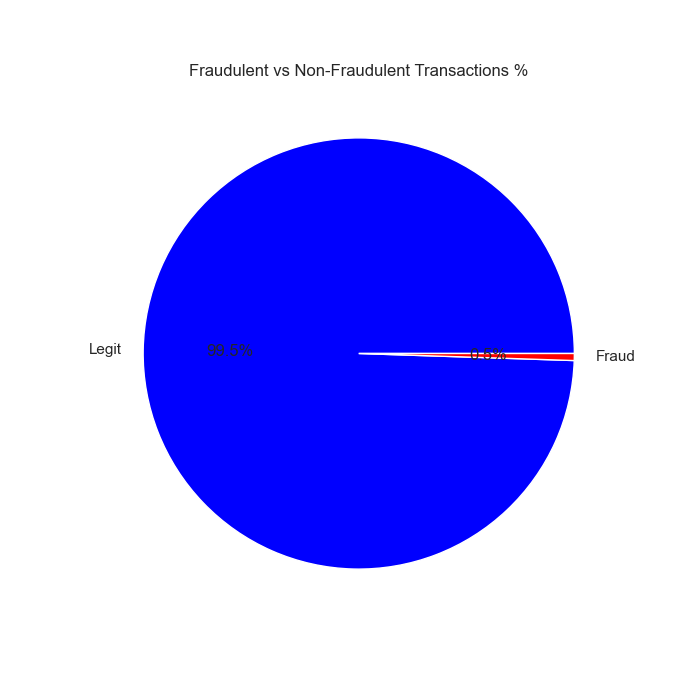
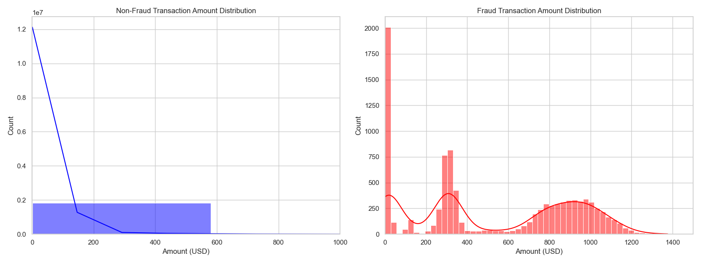
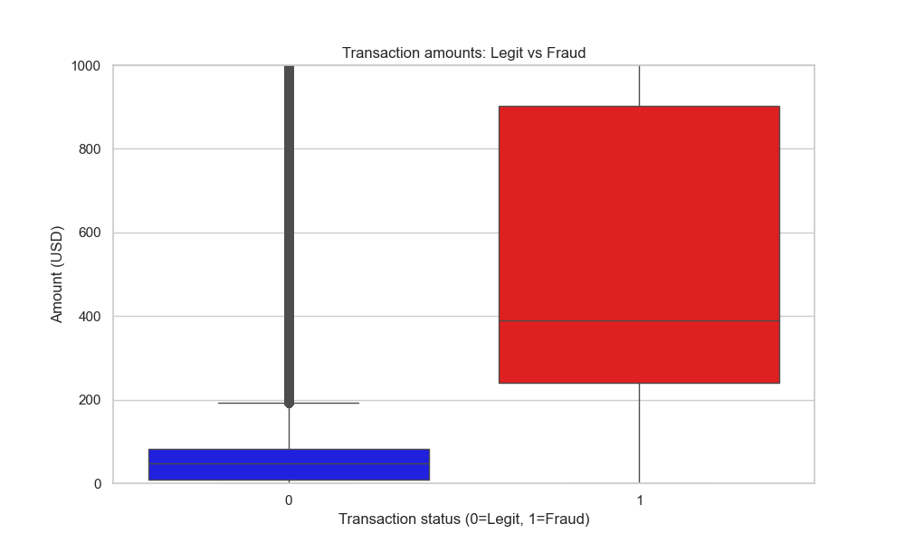
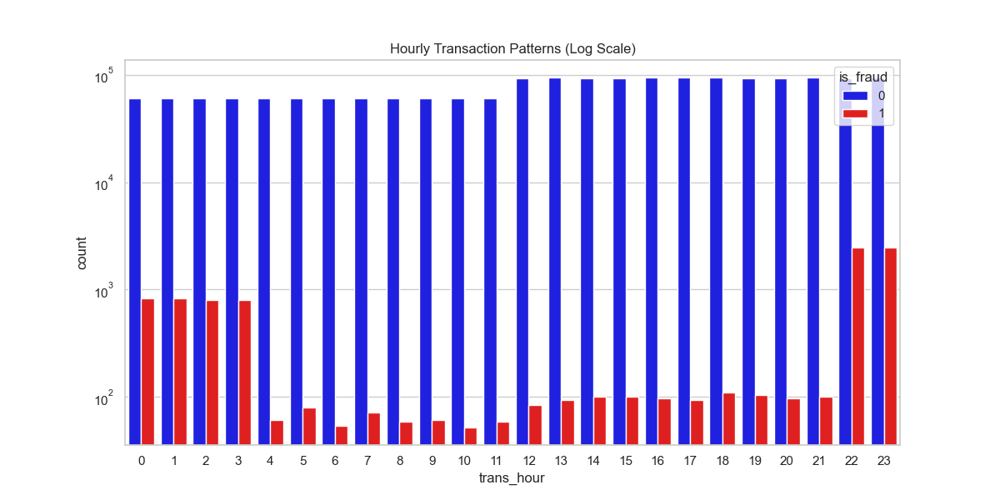
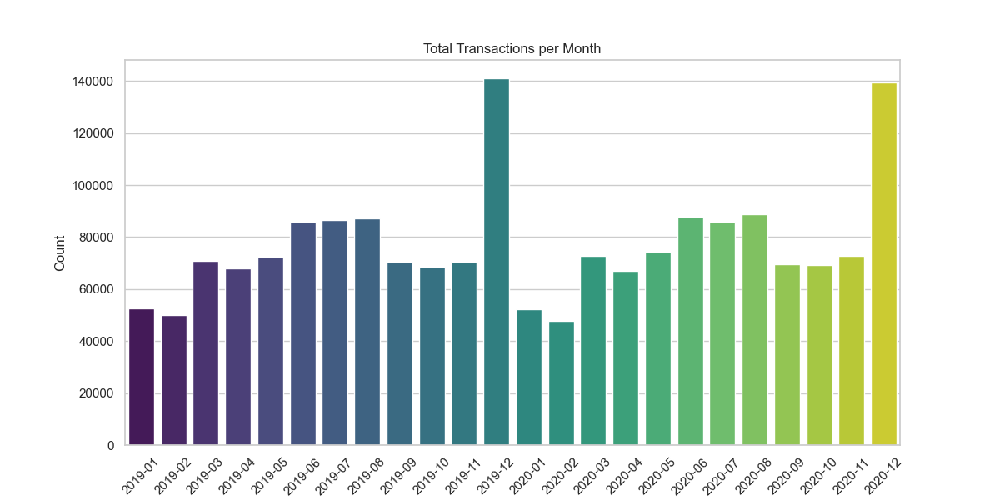
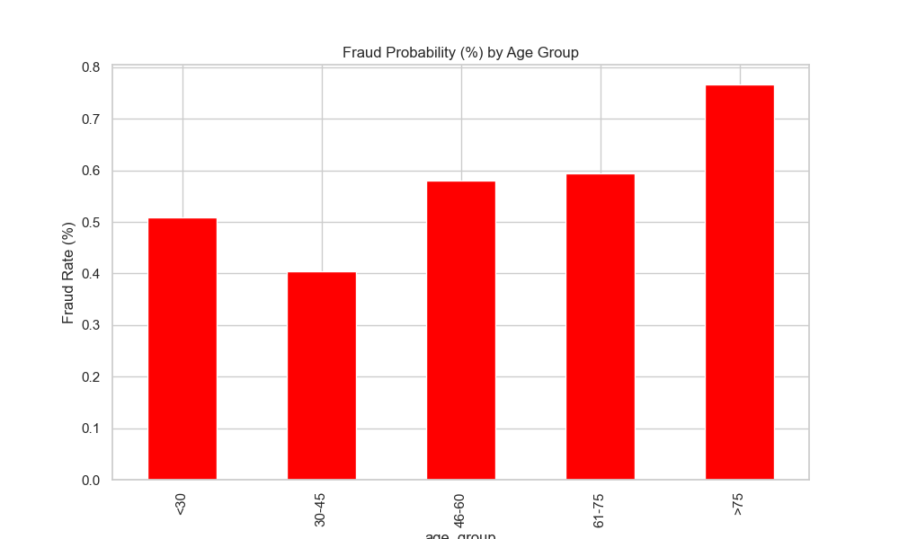

# Fraud Detection & Customer Risk Analyzer (Python CLI)

This project is a Python-based, menu-driven console application that analyzes large-scale credit card transaction data to identify risky customers and flag suspicious transactions. The system combines behavioral feature engineering, statistical thresholds, and rule-based logic to support fraud investigation and prioritization.

All steps are executed interactively through a command-line interface.




## What This Project Does

The application:
- Loads and merges large transaction datasets
- Cleans and preprocesses raw transaction data
- Performs exploratory data analysis and visualization
- Builds customer-level behavioral profiles
- Assigns each customer a weighted risk score and risk band
- Flags suspicious transactions based on customer risk and transaction patterns
- Evaluates detection performance and estimates financial impact
- Exports CSV and text-based summary reports


## Data Used
This project uses the **Credit Card Transactions Fraud Detection Dataset** 

- Source: Kaggle  
- Dataset name: *Credit Card Transactions Fraud Detection Dataset*  
- Link: [Credit Card Transactions Fraud Detection Dataset – Kaggle](https://www.kaggle.com/datasets/kartik2112/fraud-detection/data)


The system was executed on a merged dataset created from:
- `fraudTrain.csv`
- `fraudTest.csv`

After merging:
- **Total transactions:** 1,852,394  
- **Unique customers (cards):** 999  
- **Actual fraud cases:** 9,651 (~0.52% of all transactions)

The dataset contains transaction timestamps, amounts, merchant information, categories, customer identifiers, and a fraud label (`is_fraud`).

> Raw CSV files are not included in this repository due to file size.


## Processing Pipeline

### 1. Data Loading
Both datasets are loaded and concatenated into a single DataFrame using the `DataManager` class.

### 2. Initial Exploration
A quick audit is performed using `DataExplorator`, which prints:
- Dataset shape and column names
- Data types and numerical statistics
- Missing value checks (none found)
- Unique counts for categorical columns

### 3. Data Cleaning & Preprocessing
The `DataPreprocessor` applies the following steps:
- Removal of duplicate rows
- Conversion of datetime fields (`trans_date_trans_time`, `dob`)
- Extraction of time-based features:
  - transaction hour
  - transaction day
  - transaction month/year
- Calculation of customer age at transaction time
- Removal of non-essential columns (names, street, transaction IDs, unix time)

Final cleaned dataset:
- **1,852,394 rows**
- **20 columns**


## Data Visualization (Post-Preprocessing)

After preprocessing, the system performs visual analysis on the cleaned dataset using the `DataVisualizer` class.  
All visualizations are generated interactively via a dedicated visualization menu in the console.

The following analyses are produced:

### Fraud Distribution
- Pie chart showing the proportion of fraudulent vs legitimate transactions.



The figure shows the percentages distribution of fraud vs. legit transactions as would be demonstrated in real world transactions.

### Transaction Amount Analysis
- Side-by-side histograms comparing transaction amounts for fraud and non-fraud cases.
- Boxplot highlighting differences and outliers between legitimate and fraudulent transaction amounts.





### Time-Based Patterns
- Hourly transaction frequency by fraud status (log-scaled for visibility).
- Monthly transaction volume trends across the dataset timeline.





### Age-Based Risk Analysis
- Bar chart showing fraud probability (%) across customer age groups.



### Category-Based Risk Analysis
- Horizontal bar chart ranking transaction categories by fraud rate.


These visualizations help reveal behavioral patterns, validate risk assumptions, and support the design of downstream customer risk scoring and transaction flagging logic.


## Customer Feature Engineering

Customer profiles are constructed by grouping transactions by card number (`cc_num`).  
For each customer, the following behavioral features are computed:

- Total spending
- Average transaction amount
- Maximum transaction amount
- Total transaction count
- Number of active transaction days
- Daily transaction velocity
- Recent rolling average spending trend
- Most frequent transaction category
- Most frequent transaction hour

Result:
- **999 customer-level profiles**, one per card


## Customer Risk Scoring

Each customer receives a weighted risk score based on four behavioral signals:

1. **High Transaction Velocity**
   - Z-score calculated on daily transaction velocity
   - Points added if the z-score exceeds a defined threshold

2. **Spending Spike Behavior**
   - Ratio of recent rolling average spending to historical average
   - Points added if abnormal spikes are detected

3. **High Amount in Risky Categories**
   - Large transactions occurring in selected online and POS categories

4. **Night-Time Transaction Behavior**
   - Peak transaction activity between 11 PM and 4 AM

The total score determines the customer’s risk band:
- Low
- Medium (≥ 30)
- High (≥ 50)
- Critical (≥ 70)

### Risk Band Distribution (999 customers)
- Low: 866  
- Medium: 116  
- High: 13  
- Critical: 4  

Customer risk profiles are exported to:
- `customer_risk_summary.csv`


## Transaction Flagging

Each transaction is flagged as suspicious if **any** of the following conditions apply:
- High-risk category combined with a high transaction amount
- Night-time transaction with a high amount
- Transaction amount significantly larger than the customer’s historical average
- Customer belongs to the **Critical** risk band

Flagged transactions are saved to:
- `flagged_transactions.csv`


## Results & Performance

After running the full pipeline:

### Fraud Detection Performance
- Total transactions: 1,852,394
- Actual fraud cases: 9,651
- Fraud transactions correctly flagged: **7,216**
- Missed fraud cases: 2,435
- False alarms: 76,061

**Detection Rate (Recall):**
- **74.77%**

This indicates that the system successfully detected nearly **three out of every four fraudulent transactions**.


## Financial Impact

The total transaction amount associated with correctly flagged fraud cases:
- **$4,990,545.73**

This represents the estimated amount of fraudulent spending identified by the system.


## Fraud Concentration Insights

The most frequently flagged transaction categories were:
- grocery_pos
- shopping_net
- shopping_pos
- misc_net
- misc_pos

This suggests that fraud activity is concentrated in specific transaction types rather than being uniformly distributed.


## Outputs Generated

The application generates:
- `outputs/customer_risk_summary.csv`: Customer-level risk scoring results.
- `outputs/flagged_transactions_sample.csv`: Sample of flagged transactions.
- The full `outputs/flagged_transactions.csv` file is generated locally but excluded from the repository due to GitHub file size limits.
- `final_summary.txt` — text report summarizing risk distribution, detection performance, and financial impact

Generated reports are saved in the `outputs/` directory.


## How to Run

1. Install dependencies:
```bash
pip install -r requirements.txt
